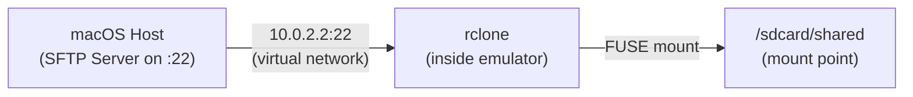
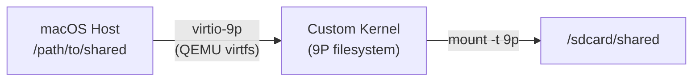

# Android Emulator: Shared Folders + Magisk Root

Current config: [home/android.nix](home/android.nix) -- Android 10 (API 29), arm64-v8a, google_apis_playstore image.

---

## Part 1: Magisk Root (prerequisite -- needed for both shared folder approaches)

### Approach A: Offline Ramdisk Patching via Nix Derivation (Recommended)

The most declarative approach. Patches the ramdisk at Nix build time, producing a ready-to-use patched image.

**How it works:**

1. Fetch Magisk v25.2 APK from GitHub releases (`https://github.com/topjohnwu/Magisk/releases/download/v25.2/Magisk-v25.2.apk`)
2. Extract `lib/arm64-v8a/libmagiskboot.so`, `lib/arm64-v8a/libmagiskinit.so`, `lib/arm64-v8a/libmagisk64.so`, `lib/arm64-v8a/libmagisk32.so` from the APK (they are ELF binaries despite `.so` extension)
3. Locate the stock `ramdisk.img` at `$ANDROID_SDK_ROOT/system-images/android-29/google_apis_playstore/arm64-v8a/ramdisk.img`
4. Patch the ramdisk CPIO: inject magiskinit as the init binary, embed magisk configs
5. Output `ramdisk-patched.img`

**Integration in `android.nix`:**

- Create a Nix derivation `patchedRamdisk` that runs the patching steps using `magiskboot` (extracted from the APK, run via Rosetta or a Linux builder)
- Add `-ramdisk ${patchedRamdisk}` to `emulatorFlags`
- On first boot, Magisk Manager installs itself from the embedded stub

**Caveat:** `magiskboot` is a Linux ARM64 binary. On macOS, it cannot run natively. Options:

- Run patching on a Linux remote builder (`system = "aarch64-linux"` derivation)
- Use a pre-patching script that runs the patch via `adb shell` on a booted emulator (hybrid approach)
- Use the emulator itself to run `magiskboot` by pushing it via adb (see Approach B)

### Approach B: rootAVD Runtime Script (Battle-Tested)

Uses the community [rootAVD](https://gitlab.com/newbit/rootAVD) script which patches the ramdisk while the emulator is running.

**How it works:**

1. Fetch rootAVD from GitLab as a Nix derivation
2. Boot the emulator normally
3. Run: `rootAVD $ANDROID_SDK_ROOT/system-images/android-29/google_apis_playstore/arm64-v8a/ramdisk.img`
4. rootAVD downloads Magisk (or uses a provided version), patches the ramdisk via `adb shell`, creates a `.backup`
5. Cold-restart the emulator -- Magisk is now active

**Integration in `android.nix`:**

```nix
# Fetch rootAVD
rootAVD = pkgs.fetchFromGitLab {
  owner = "newbit";
  repo = "rootAVD";
  rev = "...";
  sha256 = "...";
};

# Shell aliases
home.shellAliases = {
  android-root = "${rootAVD}/rootAVD.sh $ANDROID_SDK_ROOT/${systemImagePath}/ramdisk.img";
};
```

**Pros:** Battle-tested on google_apis_playstore + arm64-v8a + API 29. Handles all edge cases. Supports Magisk Stable/Canary/Alpha.
**Cons:** Requires a running AVD. One-time manual step (not fully declarative). Modifies the SDK's system-image directory in-place.

### Approach C: Hybrid (Recommended Practical Solution)

Combine both: use a Nix-managed shell script that automates the patching process on a running emulator using Magisk v25.2 APK fetched by Nix:

1. Nix fetches Magisk v25.2 APK (fixed-output derivation, pinned hash)
2. A `android-root` alias script:

- Pushes the APK to the running emulator via `adb push`
- Extracts magiskboot inside the emulator (`adb shell`)
- Patches the ramdisk using magiskboot inside the emulator (ARM64-native)
- Pulls the patched ramdisk back to the host
- Copies it to the system-image path

1. Subsequent boots use the patched ramdisk automatically

This gives you Nix-pinned Magisk version (v25.2) with a one-time setup command. The patching runs natively inside the emulator (no cross-compilation issues).

---

## Part 2: Shared Folders (50GB+ without duplication)

**Key constraint:** The stock Android emulator kernel (goldfish/ranchu) does NOT include 9P, NFS, or CIFS filesystem modules. It DOES include FUSE support (officially supported by Android).

### Approach A: rclone SFTP via FUSE (Recommended -- Stock Kernel)

Uses macOS's built-in SSH/SFTP server + rclone on Android to mount the host folder via FUSE.



**Step 1 -- Enable macOS SSH/SFTP server (declarative):**

nix-darwin doesn't have a built-in SSH server module, but we can use an activation script:

```nix
system.activationScripts.postActivation.text = ''
  # Enable Remote Login (SSH/SFTP) for the current user
  sudo systemsetup -setremotelogin on 2>/dev/null || true
'';
```

Or document it as a manual prerequisite: `sudo systemsetup -setremotelogin on`

**Step 2 -- Fetch rclone arm64 static binary via Nix:**

```nix
rcloneAndroid = pkgs.fetchurl {
  url = "https://downloads.rclone.org/v1.68.2/rclone-v1.68.2-linux-arm64.zip";
  sha256 = "...";
};
```

**Step 3 -- Setup and mount script (`android-shared-setup` alias):**

One-time setup that:

1. Pushes rclone binary to `/data/local/tmp/rclone` via `adb push`
2. Generates an SSH key pair for passwordless auth and installs the public key on macOS
3. Creates mount point `/sdcard/shared`

**Step 4 -- Mount alias (`android-shared-mount`):**

```bash
adb shell su -c '/data/local/tmp/rclone mount \
  :sftp:/Users/$USER/path/to/shared /sdcard/shared \
  --sftp-host 10.0.2.2 \
  --sftp-user $USER \
  --sftp-key-file /data/local/tmp/id_ed25519 \
  --vfs-cache-mode off \
  --daemon'
```

**Step 5 (optional) -- Auto-mount via Magisk boot service:**

Create a Magisk module with a `service.sh` that runs rclone mount on boot:

```
/data/adb/modules/rclone-mount/
  module.prop
  service.sh    # runs rclone mount at boot
```

**Pros:**

- Works with stock kernel (no custom build)
- FUSE is officially supported by Android
- No file duplication -- reads/writes go directly to host filesystem
- SSH/SFTP is built into macOS, no additional server needed
- Reasonable performance over emulator's virtual loopback (all local, no real network)

**Cons:**

- SSH encryption adds some CPU overhead (minimal for local traffic)
- Requires Magisk root (which we're setting up anyway)
- FUSE has some overhead compared to kernel-native filesystems
- rclone binary needs to be pushed to the emulator

### Approach B: Custom Kernel with 9P Filesystem (Best Performance)

Build a custom goldfish kernel with 9P support enabled, then use QEMU's `-virtfs` passthrough.



**Step 1 -- Build custom kernel (on a Linux builder):**

Clone the goldfish kernel source for API 29:

```bash
git clone -b android-goldfish-4.14-dev https://android.googlesource.com/kernel/goldfish
```

Enable these kernel config options (via `make menuconfig` or defconfig fragment):

```
CONFIG_NET_9P=y
CONFIG_NET_9P_VIRTIO=y
CONFIG_9P_FS=y
CONFIG_9P_FS_POSIX_ACL=y
CONFIG_VIRTIO=y
CONFIG_VIRTIO_PCI=y
```

Cross-compile for arm64 using AOSP prebuilt toolchain. Output: `arch/arm64/boot/Image.gz`

**Step 2 -- Integrate in `android.nix`:**

```nix
# Custom kernel (built via Nix derivation on Linux builder)
customKernel = pkgs.callPackage ./android-kernel.nix {};

emulatorFlags = lib.concatStringsSep " " [
  # ... existing flags ...
  "-kernel ${customKernel}/Image.gz"
  "-qemu -virtfs local,path=/Users/${config.home.username}/shared,mount_tag=hostshare,security_model=mapped-xattr"
];
```

**Step 3 -- Mount inside emulator (via Magisk boot service):**

```bash
mkdir -p /sdcard/shared
mount -t 9p -o trans=virtio,version=9p2000.L hostshare /sdcard/shared
```

**Step 4 -- Create a Nix derivation for the kernel build:**

This is complex -- requires a Linux builder with the AOSP cross-compilation toolchain. The XDA guide by newbit covers the full process for arm64. The derivation would:

1. Fetch goldfish kernel source
2. Fetch AOSP prebuilt GCC/Clang toolchain
3. Apply defconfig with 9P options enabled
4. Build and output the kernel image

**Pros:**

- Best possible performance (near-native filesystem access)
- No network overhead, no encryption
- Direct virtio passthrough between host and guest
- Clean QEMU-level integration

**Cons:**

- Requires building and maintaining a custom kernel (complex, fragile across SDK updates)
- Requires a Linux builder for cross-compilation (cannot build arm64 kernel on macOS directly)
- The Android emulator's QEMU fork may not have virtio-9p compiled in (untested on macOS arm64 build -- may need verification)
- 9P security model quirks (file ownership mapping)

---

## Recommended Implementation Order

1. **Magisk first** (Approach C -- hybrid): Set up Magisk v25.2 using the Nix-managed hybrid approach. This is a prerequisite for both shared folder approaches.
2. **Shared folders via rclone** (Approach A): Start with rclone SFTP since it works immediately with the stock kernel and provides a working solution.
3. **Optional: Custom kernel** (Approach B): If rclone performance is insufficient for your workload, build a custom kernel with 9P support as an upgrade path.

---

## Changes to `home/android.nix`

The implementation will modify [home/android.nix](home/android.nix) to add:

- Magisk v25.2 APK as a `pkgs.fetchurl` fixed-output derivation
- rootAVD (or patching script) as a fetchable derivation
- rclone arm64 binary as a `pkgs.fetchurl` derivation
- New shell aliases: `android-root`, `android-shared-setup`, `android-shared-mount`, `android-shared-umount`
- Configuration variables for the shared folder path
- Optional: Magisk module derivation for auto-mount at boot
