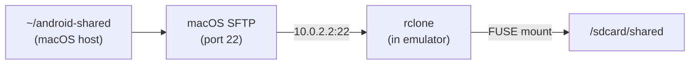

# Android Emulator: Shared Folders + Magisk Root

Config: [home/android.nix](home/android.nix) -- Android 10 (API 29), arm64-v8a, google_apis_playstore.

**Chosen approaches:**

- Magisk: Hybrid (Nix-pinned APK + runtime patching via adb on running emulator)
- Shared folders: rclone SFTP via FUSE (stock kernel, no custom build)

**User-specified settings:**

- Shared folder on host: `~/android-shared`
- Mount point in emulator: `/sdcard/shared`
- macOS SSH: automate enabling via nix-darwin activation script

---

## Part 1: Magisk v25.2 Root (Hybrid Approach)

Nix fetches and pins Magisk v25.2 APK. A shell script (`android-root`) automates ramdisk patching by pushing binaries to the running emulator and patching inside it (ARM64-native).

**Nix derivations:**

```nix
magiskApk = pkgs.fetchurl {
  url = "https://github.com/topjohnwu/Magisk/releases/download/v25.2/Magisk-v25.2.apk";
  sha256 = "...";  # pin exact hash
};
```

`**android-root` script flow:

1. Check emulator is running via `adb devices`
2. Push Magisk APK to emulator: `adb push ${magiskApk} /data/local/tmp/magisk.apk`
3. Inside emulator (via `adb shell`):

- `cp /data/local/tmp/magisk.apk /data/local/tmp/magisk.zip`
- Extract ARM64 binaries: `unzip -jo magisk.zip lib/arm64-v8a/libmagiskboot.so -d /data/local/tmp/`
- Rename and chmod the binaries
- Copy stock ramdisk: `cp /system-images/.../ramdisk.img /data/local/tmp/ramdisk.img`
- Patch: `./magiskboot unpack ramdisk.img && ./magiskboot cpio ramdisk.cpio "add 0750 init magiskinit" ... && ./magiskboot repack ramdisk.img`

1. Pull patched ramdisk back: `adb pull /data/local/tmp/ramdisk-patched.img`
2. Copy to SDK system-image path (replacing stock ramdisk, after backing up)
3. Print instructions to cold-restart the emulator

**After patching:** The emulator boots with Magisk on every subsequent start. The Magisk Manager app can be installed from the embedded APK stub on first boot.

---

## Part 2: Shared Folders via rclone SFTP + FUSE



### Step 1: Enable macOS SSH/SFTP (activation script)

nix-darwin doesn't have a `services.sshd` module, but we can use the system activation hook. This goes in the system-level nix-darwin config (not home-manager):

```nix
# In the nix-darwin system config (e.g., darwin.nix or similar)
system.activationScripts.postActivation.text = lib.mkAfter ''
  if ! systemsetup -getremotelogin 2>/dev/null | grep -q "On"; then
    systemsetup -setremotelogin on 2>/dev/null || true
  fi
'';
```

If the user's dotfiles use a split config where `android.nix` is home-manager only, we may need to add this to whatever file manages `system.activationScripts`. We'll check the actual repo structure.

### Step 2: Fetch rclone arm64-linux

```nix
rcloneAndroid = pkgs.fetchzip {
  url = "https://downloads.rclone.org/v1.68.2/rclone-v1.68.2-linux-arm64.zip";
  sha256 = "...";
  stripRoot = true;
};
```

This gives us `${rcloneAndroid}/rclone` -- the static ARM64 Linux binary.

### Step 3: `android-shared-setup` alias (one-time)

Script that:

1. Creates `~/android-shared` directory on host if it doesn't exist
2. Pushes rclone binary: `adb push ${rcloneAndroid}/rclone /data/local/tmp/rclone`
3. Sets permissions: `adb shell su -c 'chmod 755 /data/local/tmp/rclone'`
4. Generates SSH key pair inside emulator: `adb shell su -c 'ssh-keygen -t ed25519 -f /data/local/tmp/id_ed25519 -N ""'`
5. Pulls public key and appends to `~/.ssh/authorized_keys` on macOS
6. Creates mount point: `adb shell su -c 'mkdir -p /sdcard/shared'`

### Step 4: `android-shared-mount` alias

```bash
adb shell su -c '/data/local/tmp/rclone mount \
  :sftp:"/Users/avisek/android-shared" /sdcard/shared \
  --sftp-host 10.0.2.2 \
  --sftp-user avisek \
  --sftp-key-file /data/local/tmp/id_ed25519 \
  --sftp-set-modtime=false \
  --vfs-cache-mode off \
  --no-modtime \
  --daemon'
```

### Step 5: `android-shared-umount` alias

```bash
adb shell su -c 'umount /sdcard/shared'
# Or: adb shell su -c 'fusermount -u /sdcard/shared'
```

---

## Implementation Details

All changes go in [home/android.nix](home/android.nix). New `let` bindings:

- `sharedFolderHost` = `"${config.home.homeDirectory}/android-shared"`
- `sharedFolderGuest` = `"/sdcard/shared"`
- `magiskApk` = fetchurl derivation for Magisk v25.2 APK
- `rcloneAndroid` = fetchzip derivation for rclone arm64-linux
- `androidRootScript` = pkgs.writeShellScript for the Magisk patching flow
- `androidSharedSetupScript` = pkgs.writeShellScript for one-time rclone setup
- `androidSharedMountScript` = pkgs.writeShellScript for mounting
- `androidSharedUmountScript` = pkgs.writeShellScript for unmounting

New shell aliases:

- `android-root` = runs Magisk patching (one-time, requires running emulator)
- `android-shared-setup` = one-time rclone + SSH key setup
- `android-shared-mount` = mount ~/android-shared at /sdcard/shared
- `android-shared-umount` = unmount

SSH activation will need to go in the system-level nix-darwin config (we'll check repo structure).
